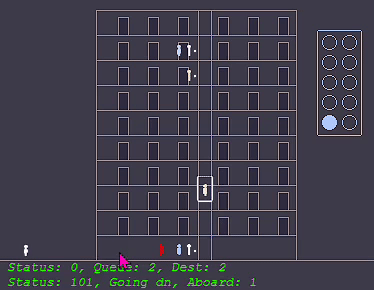

# SimElevator

Simulation of an elevator and its passengers, written with PixiJS and Node+Parcel. Visit my website to view live demo at https://kamilluto.com/. 

## Description

This code aims to simulate a real-world elevator and its passengers by only allowing passengers to interact with the elevator but not vice versa. 

### Game design rule

The elevator does not have access to any information about the passengers. The elevator only knows whether the door is still open due to being blocked, and what hall and console buttons were pressed. The passengers, however, can interact with the elevator, e.g.: press hall buttons, press elevator's console buttons, and hold the door.

## Elevator's Direction Logic

The logic that control's elevtor's direction:

1. Always **continue** moving up if the highest request is above.
2. Only **continue** moving down if the lowest **console** request is below.
3. When moving up, always stop at the console's requested floors.
4. When moving down, always stop at the console and hall requests.

This logic simulates one old evelator that I used to ride when I was a kid.

## Feedback is Welcome!

Please share your feedback, thoughts, ideas, and recommendations on anything that I can do better. I'm still learning PixiJS, Parcel, Node, and JS really. It is a neverending journey, learning!

# Changelog

## [Not released]

Changed
* Make app global. 
* Replace master container and use app.stage.addChild instead.

Fixed
* Fix loading PIXI as a global and as a module.
* Fix various syntax errors.
* Fix elevetor leaving before last boarding passenger's X-coordinate is on the elevator.

## [2.0.0-beta] 02-21-2025

Added

Changed
* Transitioned code to PixiJS 8.0.
* Implemented Parcel/Node.

Fixed
* Removed onboading and exiting counts from the Elevator class because they disobeyed the game design rule.
